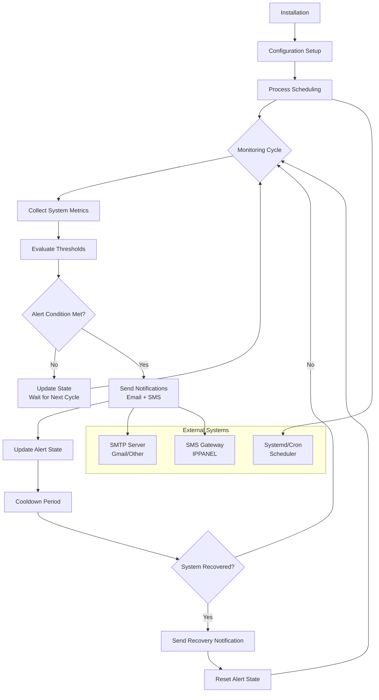

# Server Monitoring Architecture & Lifecycle

This document explains how the server monitoring system integrates with your infrastructure and the complete lifecycle of monitoring operations.

## System Integration Overview

The monitoring system is designed to be lightweight and non-intrusive, running as a scheduled process that collects system metrics and sends notifications when thresholds are exceeded.

## Lifecycle Flowchart



## Detailed Lifecycle Phases

### 1. Installation Phase
```
├── Clone Repository
├── Create Virtual Environment (.venv)
├── Install Dependencies (pip install -r requirements.txt)
├── Copy Configuration (config.sample.json → config.json)
├── Set Permissions (chmod 600 config.json)
└── Configure Scheduler (systemd/cron)
```

### 2. Configuration Phase
- **config.json**: Contains all runtime configuration
  - Notification settings (email, SMS)
  - Threshold values for alerts
  - Service monitoring targets
  - API credentials and endpoints

### 3. Execution Phase

#### Manual Execution
```bash
# Single health check
python3 monitor.py --run-once

# Internal diagnostics
python3 monitor.py --self-test

# Test notifications
python3 monitor.py --test-alert
```

#### Automated Execution
- **Systemd Timer**: Scheduled execution with logging
- **Cron Job**: Traditional scheduling
- **Manual Triggers**: On-demand health checks

### 4. Monitoring Cycle

#### Metric Collection
The monitor collects real-time system metrics:
```
├── CPU Statistics (/proc/stat)
├── Memory Information (/proc/meminfo)
├── Load Average (/proc/loadavg)
├── Disk Usage (shutil.disk_usage)
├── Inode Usage (os.statvfs)
├── Swap Activity (/proc/vmstat)
└── Service Status (systemctl)
```

#### Threshold Evaluation
Each metric is compared against configured thresholds:
- **CPU Busy %** > threshold → Alert
- **IOWait %** > threshold → Alert
- **Memory Usage %** > threshold → Alert
- **Load per CPU** > threshold → Alert
- **Disk Usage %** > threshold → Alert
- **Services Down** → Alert

#### Alert Logic
```
Consecutive Failures >= Required Count
AND
Time since Last Alert >= Cooldown Period
THEN
Trigger Alert
```

### 5. Notification Phase

#### Email Notifications
- Uses SMTP protocol (typically Gmail)
- Supports multiple recipients
- Includes detailed metrics and reasons

#### SMS Notifications
- Uses IPPANEL API
- Supports multiple phone numbers
- Sends concise alert codes

#### Notification Flow
```
Alert Detected → Send Email → Send SMS → Log Success/Failure
```

### 6. State Management

#### Persistent State (state.json)
```json
{
  "last_cpu": {...},
  "last_pswpout": 12345,
  "last_ts": 1640995200.0,
  "breach_streak": 0,
  "last_alert_ts": 0,
  "incident_open": false
}
```

#### State Transitions
- **Healthy State**: `breach_streak = 0`, `incident_open = false`
- **Alert State**: `breach_streak >= threshold`, `incident_open = true`
- **Recovery State**: System healthy after incident

### 7. Recovery Notifications

When system returns to healthy state:
```
Send Recovery Email → Send Recovery SMS → Reset incident_open
```

## Integration Points

### System Resources Monitored
- **CPU**: Busy %, IOWait %, Steal %, Load average
- **Memory**: Available MB, Used %, Total MB
- **Storage**: Disk usage %, Inode usage %
- **Swap**: Pages swapped out per second
- **Services**: systemd service status

### External Dependencies
- **SMTP Server**: For email delivery
- **SMS API**: IPPANEL for SMS delivery
- **Systemd/Cron**: For scheduling
- **Python Environment**: Virtual environment isolation

### Security Considerations
- **Credentials**: Stored in config.json (chmod 600)
- **API Keys**: Encrypted storage recommended
- **Network**: Outbound connections to SMTP/SMS APIs
- **Permissions**: Root access for system metrics

## Performance Characteristics

### Resource Usage
- **CPU**: Minimal (< 1% during checks)
- **Memory**: ~50MB virtual environment
- **Disk**: ~100KB for state/logs
- **Network**: SMTP + SMS API calls during alerts

### Execution Time
- **Normal Check**: < 5 seconds
- **Alert with Notifications**: < 30 seconds
- **Self-Test**: < 10 seconds

### Reliability Features
- **Graceful Degradation**: Continues monitoring if notifications fail
- **State Persistence**: Survives restarts
- **Error Handling**: Comprehensive exception handling
- **Cooldown Protection**: Prevents alert spam

## Troubleshooting Integration

### Common Issues
1. **No Alerts Sent**: Check SMTP credentials, SMS API key
2. **High CPU Usage**: Monitor running too frequently
3. **State File Corruption**: Delete state.json to reset
4. **Permission Errors**: Ensure proper file permissions

### Diagnostic Commands
```bash
# Check configuration validity
python3 monitor.py --self-test

# Test notification channels
python3 monitor.py --test-alert

# Manual health check
python3 monitor.py --run-once

# View systemd logs
journalctl -u server-health-monitor.service -f
```

## Deployment Scenarios

### Single Server
```
Server → Monitor → Email/SMS → Administrator
```

### Multi-Server with Central Monitoring
```
Server1 → Monitor → Central Log → Alert System
Server2 → Monitor → Central Log → Alert System
Server3 → Monitor → Central Log → Alert System
```

### Cloud Integration
```
Server → Monitor → CloudWatch → SNS → Email/SMS
```

This architecture provides a robust, configurable monitoring solution that integrates seamlessly with system infrastructure while maintaining minimal resource overhead.